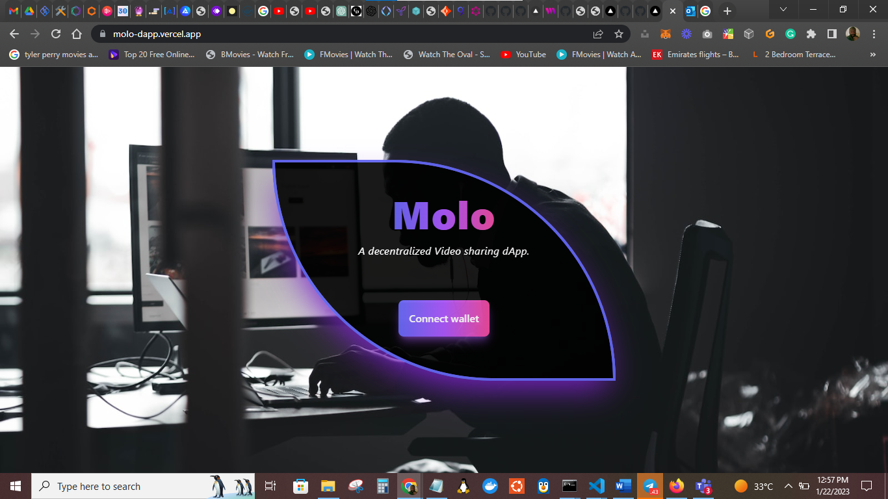

# Project Title

Molo Video Sharing Dapp

# Project Description

Molo-dapp is a decentralized video sharing platform that allows users to upload and share videos on the blockchain. This provides a secure and censorship-resistant platform for creators to share their content with the world.

# Project Snapshot

A project snapshot of the landing page.


# Project Website Link

- Live website link: [https://molo-dapp.vercel.app/](https://molo-dapp.vercel.app/)
- Github Link: [https://github.com/Web3-Gurus/molo-dapp](https://github.com/Web3-Gurus/molo-dapp)

# Project Author(s)

- Chidozie Zeno Ezeanekwe, [https://github.com/zenodavids](https://github.com/zenodavids)

- Wale Oladeinde, [https://github.com/jupiterBill](https://github.com/jupiterBill)

- Edwin Anajemba, [https://github.com/anajembaedwin](https://github.com/anajembaedwin)

- Olalekan Solomon Awoyemi, [https://github.com/soloexcel](https://github.com/soloexcel)


# How to Install and Run the Project

**Clone the repository in your folder of choice:**

 ```Javascript
 git clone https://github.com/Web3-Gurus/molo-dapp.git
 ```

**cd into the MoloClient Folder**

```bash
cd molo-dapp && cd MoloClient
```

**Install the dependencies:**

```Javascript
npm install
```

**Start the development environment:** 

```Javascript
npm run dev
```

# Usage

**The application should now be running on:**

```
http://localhost:3000
```

or any other available port to view it in the browser.

- No required input/output files.

- Ensure you are using the `Polygon Mumbai Testnet` on your `metamask wallet` or any other wallet when connecting.


# Project Dependencies
`Hardhat`
`Solidity`
`NextJS`
`React`
`Tailwind CSS`
`Livepeer`
`Eslint`
`The Graph`
`Typescript`
`IPFS`

# License
This project is licensed under Grandida License - see the LICENSE.md file for details.

### Attribution

Some parts of the code were adapted from OpenZepplin and Frontend Masters

> **DO NOT USE WITHOUT THE PERMISSION OF GRANDIDA**
